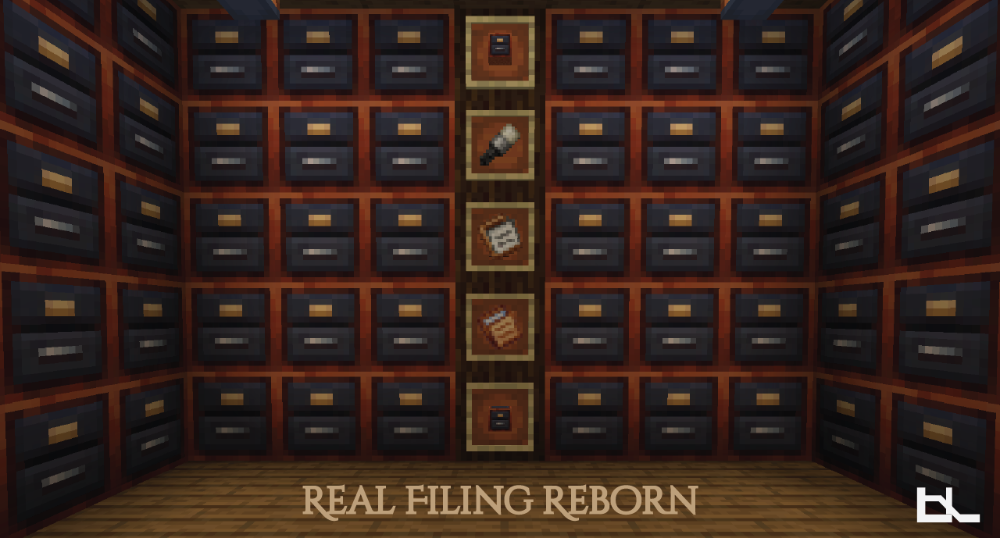

**Real Filing Reborn** is a modern storage solution for Minecraft, built on NeoForge. Inspired by the classic *Real Filing Cabinet* by BlueNeenja—completely reimagined for current versions of the game.

---

## Overview

Real Filing Reborn introduces a powerful filing system that allows you to store vast quantities of items in an organized, compact way. Whether you're running automation networks or just like tidy storage, this mod brings order to your Minecraft world.

---

## Features

### Filing Cabinet
- Holds up to **5 folders**
- Fully compatible with automation (hoppers, pipes, etc.)
- **Shift + Right-click** to open the cabinet GUI
- **Right-click** to insert a folder

---

### Filing Folders

Two folder types to suit different storage needs:

#### Regular Folder
- Stores **a single item type**, up to **2.14 billion items**
- Cannot store items with NBT data (enchantments, custom names, damage, etc.)

#### NBT Folder
- Stores up to **64 unique items** with NBT
- Perfect for enchanted or custom-named gear

---

### Eraser Tool
- Resets a folder's assignment
- Use: **Right-click** while holding an empty folder in the off-hand

---

## How to Use

1. **Craft** a Filing Cabinet and place it in the world
2. **Create** Regular or NBT Folders
3. **Bind an item** to a folder:
    - Hold the folder in your **main hand**
    - Hold the target item in your **off-hand**
    - **Right-click** to assign the item
4. **Extract items**:
    - Hold the folder in your main hand
    - **Shift + Right-click** to extract a stack
5. **Organize**:
    - Insert folders into a cabinet
    - **Shift + Right-click** the cabinet to access its GUI
    - Use automation systems to insert/extract items

---

## Modpack & Usage Permissions

You are free to use this mod in **modpacks**, **videos**, or any other community content. No special permission required.

---

## Credits

Inspired by the original *Real Filing Cabinet* by **BlueNeenja**

---
